# MATHIAS DE CASTRO

### Application Developer · Backend · Game Development

*I'm a developer who enjoys building things from scratch and understanding how they work.*
*I particularly enjoy backend development, game development, and experimenting with different technologies.*

 

**Currently looking for a software development position or a Master's degree.**

 

[GitHub](https://github.com/mathiasdecastro) · [LinkedIn](https://linkedin.com/in/mathiasdecastro) · [Email](mailto:mathias.decastrozachantke@gmail.com)

---

## ABOUT // PROFILE

I like understanding what happens behind the scenes — from application architecture and data management to low-level systems and game mechanics.

I enjoy taking an idea, breaking it down, and turning it into something that actually works.

My main interests are **backend development**, **software engineering**, and **game development**, with a particular curiosity for systems, performance, and learning how technologies work under the hood.

---

## TECH STACK // TOOLS OF THE TRADE

### Languages

  

### Backend & Data

  

### Tools & Infrastructure

  

### CI/CD & Game Development

  

Other technologies I've worked with

 

**Web:** JavaScript · HTML · CSS · React · Vue · Symfony · MySQL

**Development:** Visual Studio · VS Code

**Creative:** Figma · After Effects · Premiere Pro

---

## SELECTED PROJECTS // BUILD LOG

> A selection of things I've built, experimented with, or am currently working on.

<table>
<tr>
<td colspan="2">

### 01 — Flagship

**[Project Name](#)**

A serious application focused on **[main technical challenge]**.

Built with a focus on **[architecture / performance / scalability / reliability]**.

`Rust` · `PostgreSQL` · `Docker` · `CI/CD`

 

**[View repository →](#)**

</td>
</tr>

<tr>
<td width="50%">

### 02 — Game Development

**[Project Name](#)**

A game built around **[gameplay concept / technical challenge]**.

Exploring **[AI / networking / procedural generation / physics / etc.]**.

`C#` · `Unity`

 

**[View repository →](#)**

</td>

<td width="50%">

### 03 — Experimental

**[Project Name](#)**

A smaller project exploring **[technology / concept / idea]**.

Something fun, unusual, or simply worth building.

`C++` · `CMake` · `Linux`

 

**[View repository →](#)**

</td>
</tr>
</table>

---

## BACKGROUND // PLAYER PROFILE

**BUT Informatique**
`2023 — 2026`

Software development · Computer science · Projects · Systems

 

**Current objective**

Looking for a **software development position** or a **Master's degree** where I can keep building, learning, and working on technically interesting problems.

---

## GITHUB ACTIVITY // SYSTEM STATUS

---

## CONTRIBUTION ODYSSEY

<picture>
  <source media="(prefers-color-scheme: dark)" srcset="https://raw.githubusercontent.com/mathiasdecastro/mathiasdecastro/output/pacman-contribution-graph-dark.svg">
  
</picture>

---

## CONTACT // OPEN TO CONNECTIONS

**Interested in working together, discussing a project, or simply talking tech?**

 

[GitHub](https://github.com/mathiasdecastro) · [LinkedIn](https://linkedin.com/in/mathiasdecastro) · [Email](mailto:mathias.decastrozachantke@gmail.com)

  

*Building things, learning along the way.*

